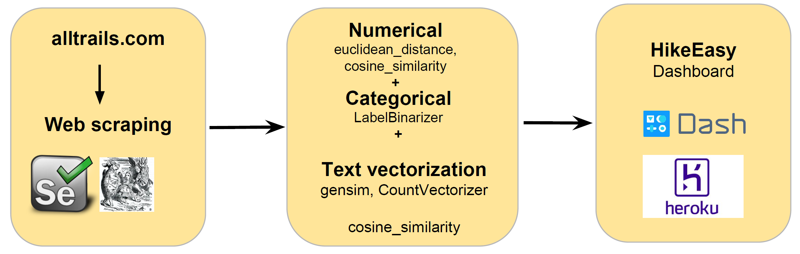

# HikeEasy

HikeEasy is a hiking trail recommendation system that provides recommendations based on user-specified trail features or trail names. As hiking is a personalized activity, finding a good trail that a hiker would enjoy is often difficult and very time consuming. While a number of great websites exist for finding hiking trails, they do not provide recommendations based on a user's expectations. To address this, I have developed HikeEasy that provides an easy-to-use dashboard where trail recommendations are summarized based on features or trails selected by users.

A google slide presentation for this may be found [here](https://bit.ly/2RSYrmv).
The web app for this recommender may be found [here](https://hike-easy.herokuapp.com/).

## Analysis pipeline
The analysis pipeline involved 1) web scraping and data cleaning, 2) data analysis involving numerical, categorical and text features, 3) web app designed using Dash by Plotly and hosted on Heroku.

## Data

Hiking trails for Ontario, Canada were obtained from alltrials.com

I scraped all trails in Ontario, Canada from alltrails.com using used Selenium and Beautifulsoup. The scraped data was saved as a Mongo database and subsequently converted to a pandas dataframe for further analyses.

## Web app for hiking trail recommendations

Web was app created using Dash by Plotly and is hosted on Heroku. The main code for the app is app.py.

Link to app [here](https://hike-easy.herokuapp.com/)
